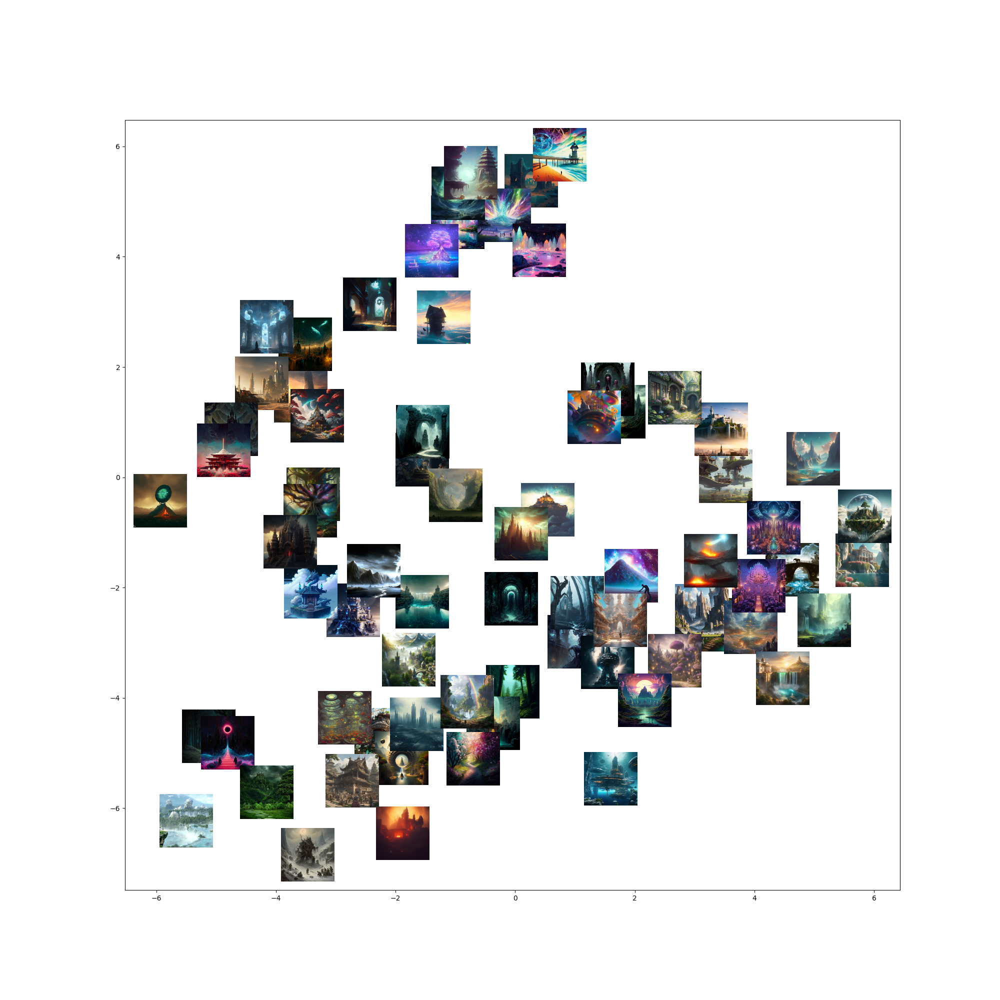
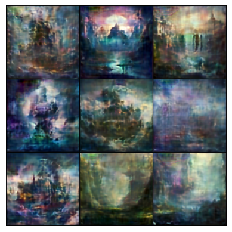
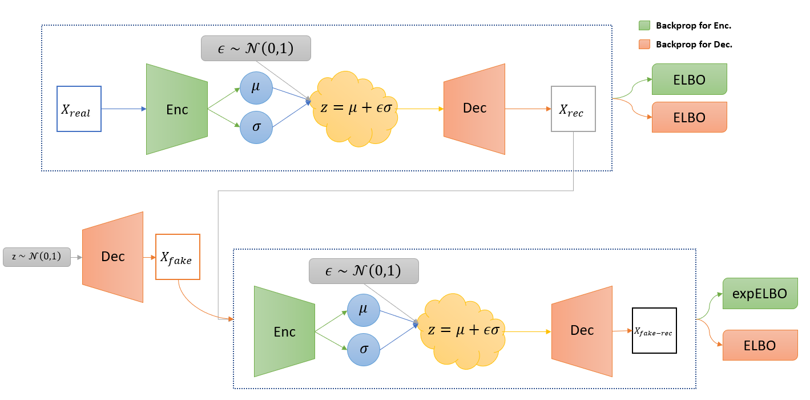

# Autoencoder used for images of fantasy places

Using Adversarial Similarity Introspective Variational Autoencoder it was possible to reduce image from 256x256 into 256 latent space while keeping good visual quality from decoder.

| Hyperparameter | Value |
|----------------|-------|
| beta_kl | 1.0 |
| beta_rec | 0.5 |
| beta_neg | 4 - 256 |
| z_dim | 256 |
| lr | 2e-4 |
| batch_size | 6 |

For faster convergence `beta_neg` was constantly changed during training. It was lowered when model stabilized and raised when model was collapsing. Using only 256 value is more stable but takes a lot longer for random sample to produce images.
## Usage

- for training model use `train.py`
- for getting latent space visualisation use `test.py`
- for image interpolation and random sampling use `img_interpolation.ipynb`
- trained model is in `saves/` directory

## Latent space visualization

## Interpolation of latent space

VAE models allow for interpolating between two images. Some examples:

<table>
  <tr>
    <td></td>
    <td></td>
    <td></td>
    <td></td>
  </tr>
  <tr>
    <td></td>
    <td></td>
    <td></td>
  </tr>
</table> 

If images latent representation are far enough, it's possible to go through other image latent space when interpolating.

## Random samples from latent space

Given tiny size of the dataset (only 80 images), latent space doesn't produce good quality new images. But it can mix dataset images to produce quite interesting results.

## What is IntroVAE family models?

IntroVAE is a combination of VAE and GAN. Compared to other VAE-GAN models it doesn't require additional discriminator as that role is integrated into autoencoder model. Encoder tries to maximise the kl divergence between real image and latent space while decoder tries to minimise it.

Next generation was Soft-IntroVAE which removed the hard margin hyperparameter that was used for boundary between fake and real images latent space. This made model easier to learn and produce good results.

Current SOTA is AS-IntroVAE, which tackles the problem of mode collapse, because of GAN component used. They also greatly improve stability of the model as loss slowly transition from reconstruction loss (blurry results but similar) to kl divergence loss (sharp images but can deform images) during training.
